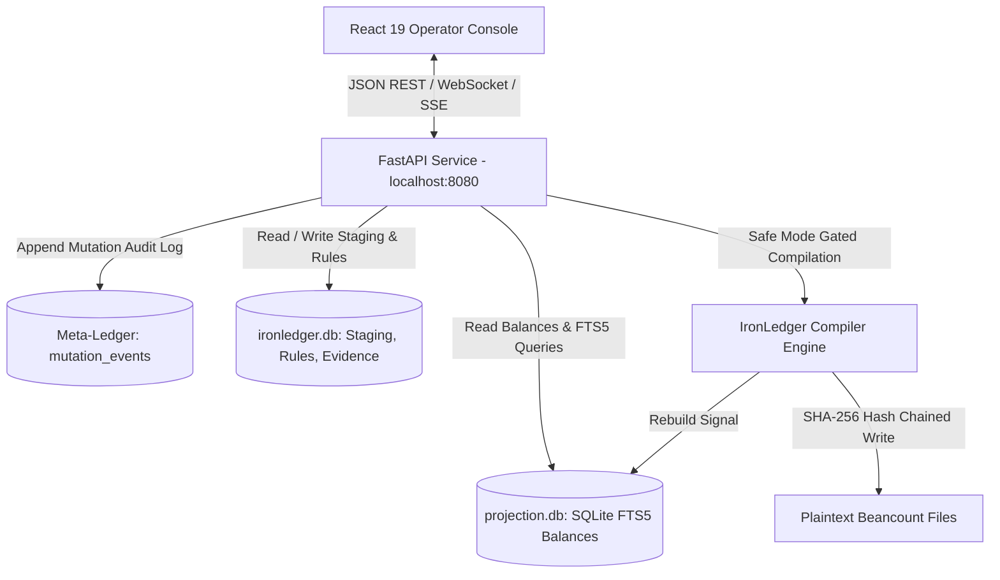

# IronLedger Frontend Design Specification: Enterprise Operator Workbench

**Status:** Validated Design Spec (Phase 5)  
**Date:** 2026-09-09  
**Target:** Phase 5 Web Frontend & High-Assurance API Service  

---

## 1. Overview & Core Invariants

IronLedger is a single-operator, high-assurance financial operating system. The Frontend Workbench serves as the primary visual mission-control console, built with **FastAPI** (backend service) and **React 19 / Vite / Tailwind CSS** (frontend workbench).

### Non-Negotiable Invariants
1. **Plaintext Beancount is the Sole Accounting Authority:** Ledger files on disk represent absolute financial truth.
2. **Zero `import beancount` Runtime Dependency:** The Python backend core and API service never import Beancount packages; plaintext is parsed, validated, and rendered deterministically.
3. **Disposable SQLite Projections:** The analytics database is a pure, rebuildable projection for sub-millisecond FTS5 search, balances, and envelope computations.
4. **Strict Safe Mode & Tamper-Evident Auditing:** All ledger modifications require authorized operator tokens or confirmation phrases and are permanently recorded in a SHA-256 hash-chained Meta-Ledger.

---

## 2. Visual Theme & Layout Architecture

- **Theme Palette:** Slate & Indigo (Modern Pro Dark / Cathryn Lavery warm accents)
  - Canvas: `#0f172a` (Slate-900)
  - Elevated Cards & Grids: `#1e293b` (Slate-800)
  - Grid Dividers & Borders: `#334155` (Slate-700)
  - Primary Action / Indigo: `#6366f1` (Indigo-500)
  - Drift Warning: `#f59e0b` (Amber-500)
  - Safe Mode Guard: `#ef4444` (Rose-500) / `#10b981` (Emerald-500)
  - Typography: Inter for UI chrome, JetBrains Mono for monetary values, Beancount syntax, and hashes.

- **Workbench Three-Pane Architecture:**
  1. **Left Sidebar:** Navigation tree (Staging Inbox, Journal Register, Account Hierarchy, Envelope Cash-Flow, Rule Engine, Multi-File Ledger Browser, Meta-Ledger Audit, Pipeline Topology).
  2. **Central Register:** High-density, keyboard-driven transaction grid equipped with confidence heatmaps, multi-column filters, and date range slicers.
  3. **Right Inspector & AI Sidecar:** Contextual real-time card showing raw evidence, rule drift metrics, account suggestions, and live Beancount syntax preview.

- **Global Chrome Elements:**
  - **Top Navigation HUD:**
    - **Safe Mode Banner:** Displays binary state with explicit allowed actions (`Staging, Rule Creation`), blocked actions (`Direct Compilation, Ledger Writes`), and token requirements.
    - **Projection Freshness Pill:** Real-time latency indicator (Green `< 5s`, Yellow `< 30s`, Red `Stale / Compile Desync`).
    - **Session Token HUD:** Active mutation token scope, remaining TTL countdown, and issuer.
    - **Global Command Palette:** Activated via `Ctrl+K` / `Cmd+K`.

---

## 3. High-Assurance Backend Architecture (`src/ironledger/web/`)



### 3.1 Meta-Ledger (`mutation_events` table)
Every compile and ledger mutation event is recorded as a first-class audit entity:
- `mutation_id` (UUIDv7 / monotonic timestamp prefix)
- `timestamp_utc` (ISO 8601)
- `operator_session_id` (Auth token fingerprint)
- `staged_count` (Number of staged transactions compiled)
- `rules_applied_count` / `rules_created_count`
- `sha256_before` (Digest of ledger prior to write)
- `sha256_after` (Digest of ledger post write)
- `sha256_event_signature` (HMAC / hash chain link to previous mutation event)

---

## 4. Key Workflows & Specialized Workbench Modules

### 4.1 Staging Confidence Heatmap & Keyboard-Only Review
- Transactions in staging display confidence heatmaps (Emerald: `>90%` match, Amber: `50-89%`, Rose: `<50%` / unclassified).
- **Zero-Mouse Review Keybindings:**
  - `↑` / `↓`: Row navigation with instant Inspector synchronization.
  - `Space`: Toggle transaction selection.
  - `Enter`: Approve staged transaction with default matched posting.
  - `Ctrl+Enter`: Approve transaction and immediately persist newly learned rule.
  - `Ctrl+R`: Open Rule Creation Wizard for active transaction.
  - `Ctrl+Shift+R`: Revise existing matched rule.
  - `Ctrl+K`: Global command palette.

### 4.2 Inspector: Beancount Preview & Rule Drift Detection
- **Exact Beancount Syntax Preview:** Real-time preview of the deterministic Beancount transaction before write:
  ```beancount
  2026-09-09 * "Whole Foods Market" "GROCERY STORE #1042"
    Assets:US:Checking          -84.12 USD
    Expenses:Food:Groceries      84.12 USD
    staged-id: "stx_01j7abc123"
  ```
- **Rule Drift Detection Engine:** Inspector computes:
  - *Hit Confidence Trend (HCT)* over time.
  - *Rule Age* & *Last Hit / Last Miss Timestamps*.
  - *Miss Ratio*: Alerts operator when a rule starts failing ("Rule drifting: 4 misses in last 7 days").

### 4.3 Rule Creation Wizard
Interactive modal/drawer providing:
- Automated regex and substring candidate extraction from raw payee.
- Immediate retroactive match preview against existing staged queue.
- Account suggestions with historical frequency weighting.

### 4.4 Multi-File Ledger Browser & Projection Delta Inspector
- Tree view of all configured `.beancount` journal files (e.g. `main.beancount`, `txns/2026.beancount`, `accounts.beancount`).
- File-level balance aggregations and diff histories.
- **Projection Delta Inspector:** Displays before/after balance differentials and affected accounts upon compilation.

### 4.5 Safe Mode Simulation Mode ("Dry-Run" Compilation)
- Allows the operator to execute a zero-mutation compile simulation.
- Returns would-be postings, generated ledger diffs, rule application summaries, and projection balance changes without touching disk.

### 4.6 Pipeline Topology Visualization
- Interactive system topology status showing data flow:
  `[OFX / Ingest]` &rarr; `[Staging DB]` &rarr; `[Rule Engine]` &rarr; `[Inspector]` &rarr; `[Meta-Ledger & Compiler]` &rarr; `[Beancount Ledger]` &rarr; `[Projection SQLite]`.

---

## 5. Verification & Testing Plan

### 5.1 Automated Backend Tests (`tests/test_web_workbench.py`)
1. **Meta-Ledger Integrity:** Validate that every compilation appends a valid row in `mutation_events` and calculates correct SHA-256 before/after hashes.
2. **Rule Drift Metrics:** Test drift calculation endpoints with synthetic hit/miss sequences.
3. **Safe Mode Enforcement:** Verify API blocks compile and mutation endpoints when safe mode is active or token is invalid.
4. **Simulation Fidelity:** Confirm that Simulation Mode returns exact diff outputs without modifying files on disk.

### 5.2 Automated Frontend Tests (Vitest + Playwright)
1. Verify keyboard navigation flow (`↑`, `↓`, `Enter`, `Ctrl+Enter`).
2. Verify visual color changes on projection freshness pill and safe mode banner.
3. Validate command palette (`Ctrl+K`) action dispatching.

